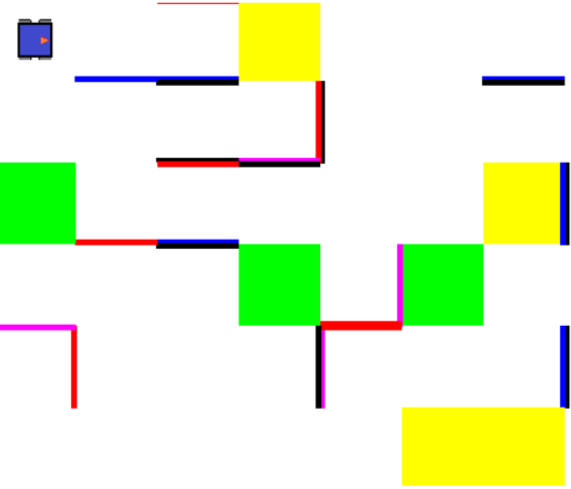

Última actualización: 9/10/2020

#


##
# **robotSim**

_ **robotSim** _ es un proyecto en desarrollo, así que le pedimos a los participantes de Candidates 2020 que estén atentos a cualquier aviso de actualización del programa. Igualmente, si hay cualquier duda no duden en contactarse con los programadores RoBorregos:

| Nombre | Correo | Github |
| ---- | ----- | ------ |
| José Cisneros | [A01283070@itesm.mx](mailto:A01283070@itesm.mx) | [@Josecisneros001](https://github.com/Josecisneros001) |
| Keven Arroyo | [A01283678@itesm.mx](mailto:A01283678@itesm.mx) | [@dake3601](https://github.com/dake3601) |
| Aurora Tijerina | [A01196690@itesm.mx](mailto:A01196690@itesm.mx) | [@AuroTB](https://github.com/AuroTB) |


### Acerca de este proyecto

El simulador fue adaptado específicamente para los retos de Candidates 2020. En esta versión, se tiene un entorno específico para el Mini Reto del [Mapa de Tesoro](https://drive.google.com/file/d/1Nu97Dv9UkiNyiNj_5eJC0MZKXQhEu2Bb/view?usp=sharing).

### Uso del simulador

1. Clonar el repositorio del proyecto.

	SSH:

	```bash
	$ git clone git@github.com:RoBorregos/robotSim.git
	```

	o HTTPS:
	```bash
	$ git clone https://github.com/RoBorregos/robotSim.git
	```

2. Entrar al directorio del proyecto.

	```bash
	$ cd robotSim
	```

2. Codificar movimientos del robot en main\_program.py

3. Simular Programa 
	```bash
	$ python robotsim.py
	```
    
### Información Archivos 
El repositorio tiene los siguientes archivos en un folder:

- **main\_program.py:** script donde se programan los movimientos del robot
- **map.json:** descripción del mapa, sirve como entrada para que el programa genere la imagen
- **map.py y robotsim.py:** building class para el objeto mapa y script de inicialización y actualización del entorno.
- **imágenes del programa:** imágen del robot y del botón de play (run.png y robot.png).

Para correr el programa, símplemente se debe de correr el comando:
```bash
	$ python robotsim.py
```

### Mapa



El mapa cuenta con las siguientes características:

- Negro: Pared sin símbolo.
- Rojo: Pared con símbolo 0.
- Azul: Pared con símbolo 1.
- Magenta: Puerta.
- Verde y Amarillo: Baldosas


### Funciones del robot

| **Función** | **Descripción** | **Input/Output** |
| --- | --- | --- |
| robot.move\_forward() | Mueve el robot a la baldosa de enfrente | - |
| robot.rotate\_right() | Gira el robot 90° a la derecha | - |
| robot.rotate\_left() | Gira el robot 90° a la izquierda | - |
| robot.insertCode(password) | Inserta un código en la puerta que tenga frente a éste. | Input: string (3 símbolos  Output: bool |
| robot.ultrasonicFront() | Obtiene la distancia frente al robot en centímetros; si no detecta nada regresa -1 | Output: int |
| robot.getColor() | Obtiene el color de la baldosa en la que el robot se encuentra | Output: string |
| robot.detectSimbolLeft() | Detecta el símbolo a la izquierda | Output: 0/1/None |
| robot.detectSimbolRight() | Detecta el símbolo a la derecha | Output: 0/1/None |
| robot.detectDoorFront() | Detecta si frente al robot hay una puerta | Output: bool |
| robot.getHuffmanTree() | Te regresa el nodo raíz (root) del árbol de Huffman | Output: nodo |

### Árbol de Huffman
El método getHuffmanTree() del robot regresa el nodo raíz del árbol de Huffman.
El nodo tiene la siguiente clase:
```bash
class Node:  
    def __init__(self, freq,data):  
        self.freq = freq  
        self.data = data  
        self.left = None  
        self.right = None  
``` 
Para más información consultar: https://www.hackerrank.com/challenges/tree-huffman-decoding/problem 

### Importante

Cuando se escriba código en main\_program.py se tienen que tomar en cuenta los siguientes detalles:

- Todo el código debe realizarse dentro de la función main()
- Si creas una función, de debe colocar como una función anidada
- Si se declara una variable, debe declararse dentro de main().

Con suerte, esto se puede solucionar en el futuro, pero por el momento se debe de realizar así para evitar que el programa tenga errores.

Si se identifica cualquier bug por favor manden mensaje a los organizadores de Candiates 2020.
